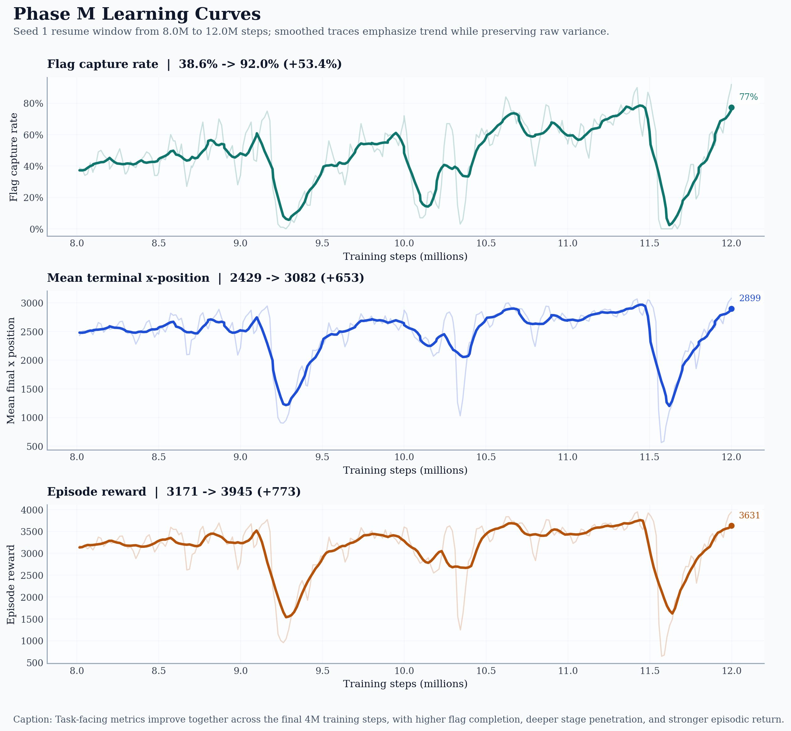
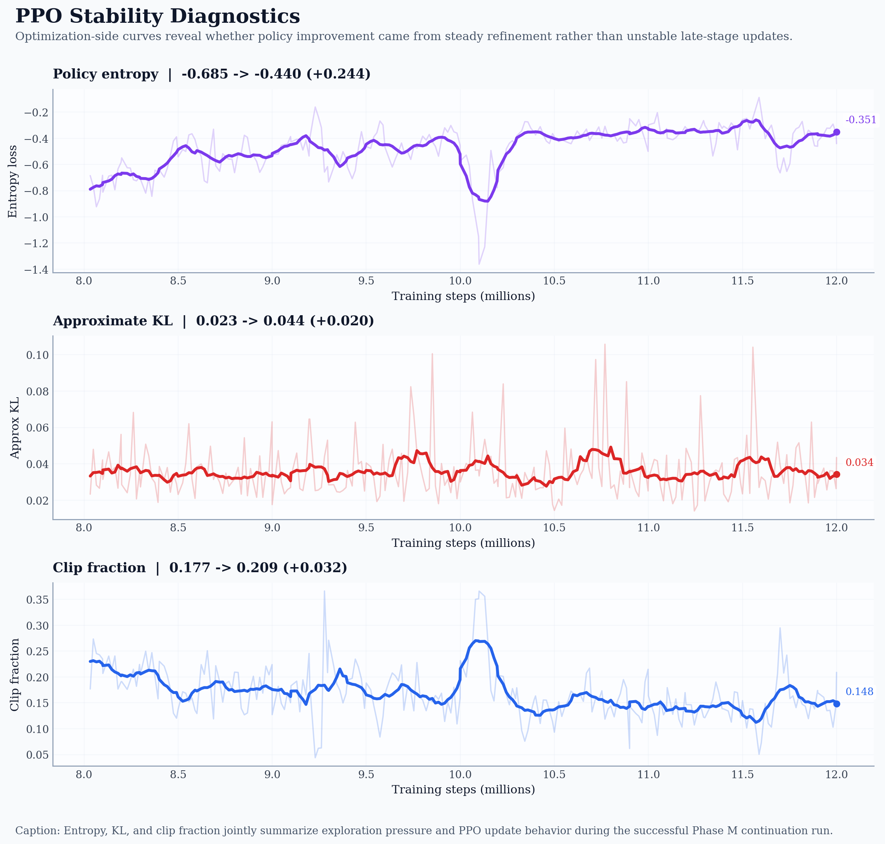
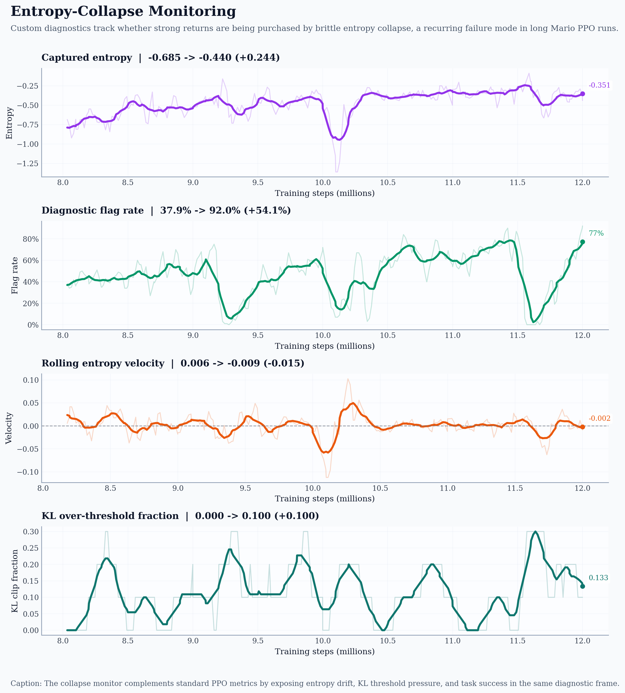

# Project Mario

A reinforcement learning agent trained with **Proximal Policy Optimization (PPO)** to play and complete **Super Mario Bros Level 1-1** using Stable Baselines3, Gymnasium, and PyTorch.

<p align="center">
  
  
  
  
</p>

<div align="center">

**Phase M — 87.5% Flag Capture Rate (Solved)**

https://github.com/user-attachments/assets/190abfe6-bbd7-475f-a2fd-19ccff0e0f41

*A PPO agent trained from scratch over 12M timesteps, conquering Super Mario Bros Level 1-1 — no human gameplay data, no imitation learning, just reinforcement learning and 18 ablation experiments (~70 hours of GPU training).*

</div>

---

## Table of Contents

- [Overview](#overview)
- [PPO Algorithm](#ppo-algorithm)
- [Techniques](#techniques)
  - [Observation Preprocessing](#observation-preprocessing)
  - [Parallel Environments](#parallel-environments)
  - [Reward Shaping](#reward-shaping)
  - [Entropy Scheduling](#entropy-scheduling)
  - [Callbacks & Logging](#callbacks--logging)
- [Project Structure](#project-structure)
- [Dependencies](#dependencies)
- [Setup](#setup)
  - [CPU Installation](#cpu-installation)
  - [GPU Installation (CUDA)](#gpu-installation-cuda)
- [Usage](#usage)
  - [Verify Environment Stack (Dry Run)](#verify-environment-stack-dry-run)
  - [Train](#train)
  - [Evaluate](#evaluate)
  - [Record Video](#record-video)
  - [TensorBoard](#tensorboard)
- [CLI Reference](#cli-reference)
- [Configuration](#configuration)
- [Current Results](#current-results)
  - [Training Results](#training-results)
- [License](#license)

---

## Overview

This project trains a deep RL agent to play **Super Mario Bros (NES)** using the `gym-super-mario-bros` environment. The agent receives 84×84 grayscale, frame-stacked observations and outputs discrete movement actions via a convolutional neural network policy (CnnPolicy) optimized with PPO.

**Primary Goal**: Achieve ≥80% flag capture rate over 50 stochastic evaluation episodes on Level 1-1.

**Status**: ✅ **SOLVED** — 87.5% flag capture (175/200 episodes) confirmed via stochastic evaluation. A detailed ablation journal documenting 18 experiments across 3 phases is maintained in `notebooks/ablation_journal/`.

---

## PPO Algorithm

**Proximal Policy Optimization (PPO)** is an on-policy, policy-gradient reinforcement learning algorithm. It improves training stability over vanilla policy gradient methods by limiting how much the policy can change in a single update.

The core idea is a **clipped surrogate objective**:

$$L^{CLIP}(\theta) = \hat{\mathbb{E}}_t \left[ \min \left( r_t(\theta) \hat{A}_t, \; \text{clip}(r_t(\theta), 1-\epsilon, 1+\epsilon) \hat{A}_t \right) \right]$$

Where:
- $r_t(\theta) = \frac{\pi_\theta(a_t | s_t)}{\pi_{\theta_{old}}(a_t | s_t)}$ is the probability ratio between the new and old policy
- $\hat{A}_t$ is the estimated advantage (computed via **Generalized Advantage Estimation / GAE**)
- $\epsilon$ is the clip range (default 0.2) — prevents destructively large policy updates

PPO also includes:
- A **value function loss** for training the critic (shared CNN backbone)
- An **entropy bonus** weighted by `ent_coef` to encourage exploration and prevent premature convergence

This project uses the Stable Baselines3 implementation of PPO with a `CnnPolicy` (convolutional feature extractor followed by separate policy and value heads).

### Key Hyperparameters

| Parameter | Default | Description |
|---|---|---|
| `learning_rate` | 2.5e-4 | Adam optimizer learning rate |
| `n_steps` | 1024 | Rollout buffer size per environment |
| `batch_size` | 512 | Minibatch size for gradient updates |
| `n_epochs` | 4 | Number of passes over the rollout buffer per update |
| `gamma` | 0.99 | Discount factor for future rewards |
| `gae_lambda` | 0.95 | GAE smoothing parameter (bias-variance trade-off) |
| `clip_range` | 0.2 | PPO clipping parameter $\epsilon$ |
| `ent_coef` | 0.01–0.05 | Entropy bonus coefficient (tuned via ablation) |

---

## Techniques

### Observation Preprocessing

Raw NES frames (240×256 RGB) are processed through a wrapper pipeline before being fed to the neural network:

1. **Frame Skipping** (`SkipFrame`): The agent repeats each action for 4 consecutive frames, accumulating rewards. This reduces the effective decision frequency from 60 FPS to 15, decreasing computational cost and temporal correlation between observations.

2. **Resize** (`ResizeObservation`): Frames are downscaled to **84×84** pixels, the standard input size for Atari/NES-style RL tasks. This dramatically reduces the dimensionality of the observation space.

3. **Grayscaling** (`GrayscaleObservation`): RGB frames are converted to single-channel grayscale. Color carries minimal information for platformer navigation, and this reduces the observation size by 3x (from 3 channels to 1).

4. **Frame Stacking** (`VecFrameStack`): The last **4 grayscale frames** are stacked along the channel axis, producing a `(4, 84, 84)` observation tensor. This gives the agent a sense of motion and velocity — a single frame contains no temporal information, but stacked frames reveal direction and speed of movement.

5. **Channel Transposition** (`VecTransposeImage`): Observations are transposed from `(H, W, C)` to `(C, H, W)` format to match PyTorch's expected input layout for convolutional layers.

**Final observation shape**: `(num_envs, 4, 84, 84)` — a batch of 4-frame grayscale stacks at 84×84 resolution.

### Parallel Environments

Multiple instances of the Mario environment run simultaneously to collect experience faster:

- **`DummyVecEnv`** (default): Runs all environments sequentially in a single process. Simpler to debug and sufficient for small `num_envs`.
- **`SubprocVecEnv`** (`--subproc` flag): Runs each environment in a separate process. Provides significant speedup by parallelizing the CPU-bound NES emulation across cores (~2x FPS improvement observed).

The default configuration uses **16 parallel environments**. Each environment is independently seeded for reproducibility.

### Reward Shaping

The raw environment reward is augmented with custom shaping signals via the `SimpleRewardShaping` wrapper:

| Signal | Winning Value | Description |
|---|---|---|
| **Forward progress** | `forward_scale=0.3` | Reward proportional to rightward x-position delta per step. Teaches the agent to move right. |
| **Death penalty** | `death_penalty=-15.0` | Negative reward when Mario loses a life. Discourages risky behavior. |
| **Flag bonus** | `flag_bonus=100.0` | Large positive reward for capturing the end-of-level flag. Incentivizes level completion. |
| **Time penalty** | `time_penalty=-0.05` | Small per-step negative reward. Creates urgency — the agent is penalized for dawdling. |

These values were tuned through ablation testing. The forward scale and flag bonus are the most impactful parameters — too low and the agent has no urgency; too high and the reward signal destabilizes training.

### Entropy Scheduling

A critical finding from ablation testing: **static entropy coefficients always eventually collapse in long PPO runs**, causing the policy to become deterministic and brittle. To address this, the project implements a custom `EntropyScheduleCallback` that **linearly decays** `ent_coef` from a high starting value to a floor:

- **Start**: `ent_coef=0.05` — strong exploration pressure during early training
- **End**: `ent_coef=0.03` — maintains a minimum exploration floor to prevent collapse

This schedule is essential for stable training beyond 3M timesteps. See the ablation journal for detailed experiments comparing static vs. scheduled entropy.

### Callbacks & Logging

Custom Stable Baselines3 callbacks provide training visibility:

- **`MarioMetricsCallback`**: Logs Mario-specific metrics to TensorBoard at episode boundaries — `mean_x_pos`, `max_x_pos`, and `flag_capture_rate` (rolling window of 100 episodes).
- **`ProgressBarCallback`**: tqdm progress bar with live metrics (x_pos, flag%, FPS, ETA).
- **`EntropyScheduleCallback`**: Implements the linear entropy decay described above.
- **`CheckpointCallback`** (SB3 built-in): Saves model checkpoints every ~500K timesteps.
- **`EvalCallback`** (SB3 built-in): Runs evaluation episodes periodically and saves the best model by mean reward.

---

## Project Structure

```
Project-Mario/
├── README.md                   # This file
├── gameplan.md                 # High-level project reference
├── pyproject.toml              # Dependencies and build config
├── configs/
│   ├── default.yaml            # Default training configuration
│   └── experiments/            # Ablation experiment configs (A through R)
├── src/
│   ├── __init__.py
│   ├── config.py               # YAML config → dataclass loader + CLI parser
│   ├── train.py                # Training entry point
│   ├── evaluate.py             # Evaluation entry point
│   ├── callbacks.py            # Custom SB3 callbacks
│   └── envs/
│       ├── __init__.py
│       ├── mario_env.py        # Environment factory (make_vec_env, make_single_env)
│       └── wrappers.py         # SkipFrame, SimpleRewardShaping
├── scripts/
│   └── checkpoint_sweep.py     # Evaluate all checkpoints in a run
├── results/
│   ├── <experiment_name>/
│   │   ├── models/             # Saved models (best + checkpoints)
│   │   └── logs/               # TensorBoard event files + eval logs
├── notebooks/
│   └── ablation_journal/       # Detailed ablation experiment notes
├── progress_log_archive/       # Phase 1–3 progress logs
├── tests/                      # Smoke tests
└── legacy/                     # V1 code (archived, not used)
```

---

## Dependencies

| Library | Version | Purpose |
|---|---|---|
| `gym-super-mario-bros` | 7.4.0 | NES Super Mario Bros environment (old Gym API) |
| `nes-py` | 8.2.1 | NES emulator backend for `gym-super-mario-bros` |
| `gymnasium` | 1.2.3 | Modern RL environment API (successor to OpenAI Gym) |
| `shimmy[gym-v21]` | 2.0.1 | Compatibility bridge from old Gym v0.21 API → Gymnasium |
| `stable-baselines3` | 2.8.0 | RL algorithm framework (PPO, callbacks, vectorized envs) |
| `torch` | 2.11.0 | Deep learning backend for policy and value networks |
| `pyyaml` | ≥6.0 | YAML config file parsing |
| `tensorboard` | ≥2.14 | Training metrics visualization and logging |
| `opencv-python` | ≥4.8 | Image processing (resize, grayscale) and video encoding |
| `moviepy` | ≥1.0 | Video post-processing support |

> **Note**: `gym-super-mario-bros` and `nes-py` are effectively abandoned (last release 2022). They are pinned to exact versions and will not change.

---

## Setup

### Prerequisites

- **Python 3.10–3.13**
- **pip** (latest recommended)
- **Git**

### CPU Installation

```bash
# Clone the repository
git clone <repository-url>
cd Project-Mario

# Create and activate a virtual environment
python -m venv .venv

# Windows
.venv\Scripts\activate

# macOS/Linux
source .venv/bin/activate

# Install the project in editable mode (CPU PyTorch)
pip install -e .
```

### GPU Installation (CUDA)

After the base install, replace CPU PyTorch with the CUDA build for GPU-accelerated training:

```bash
# Install base project first
pip install -e .

# Then replace torch with CUDA 12.4 build
pip install torch==2.11.0 --index-url https://download.pytorch.org/whl/cu124
```

> Adjust the CUDA version (`cu124`) to match your GPU driver. Check compatibility at [pytorch.org](https://pytorch.org/get-started/locally/).

### Verify Installation

```bash
python -m src.train --dry-run
```

This creates a vectorized environment, runs 100 random steps, and verifies the observation shape is `(16, 4, 84, 84)`. If this passes, the environment stack is correctly installed.

---

## Usage

All commands should be run from the project root directory.

### Verify Environment Stack (Dry Run)

```bash
python -m src.train --dry-run
```

Creates the environment, runs 100 random steps, and confirms observation shapes match expectations. Use this after installation or after making changes to the wrapper stack.

### Train

```bash
# Train with default config (5M timesteps)
python -m src.train

# Train with a specific experiment config
python -m src.train --config configs/experiments/ablation_d.yaml

# Train with a custom experiment name (outputs to results/<name>/)
python -m src.train --name my_experiment

# Train with SubprocVecEnv for faster CPU parallelization
python -m src.train --subproc

# Resume training from a checkpoint
python -m src.train --resume results/my_experiment/models/checkpoints/ppo_mario_500000_steps.zip

# Override the random seed
python -m src.train --seed 123

# Combine flags
python -m src.train --config configs/experiments/ablation_g.yaml --name ablation_g --subproc
```

Training outputs are saved to `results/<name>/`:
- `models/best_model/` — best model by mean eval reward
- `models/checkpoints/` — periodic checkpoints every ~500K steps
- `models/final_model.zip` — model state at the end of training
- `logs/PPO_*/` — TensorBoard event files
- `logs/eval/` — evaluation log (reward history as `.npz`)

### Evaluate

```bash
# Evaluate with random actions (no model)
python -m src.evaluate

# Evaluate a trained model (5 episodes by default)
python -m src.evaluate --model results/ablation_d/models/best_model/best_model.zip

# Evaluate for 50 episodes
python -m src.evaluate --model results/ablation_d/models/best_model/best_model.zip --episodes 50
```

Prints per-episode stats (x_pos, reward, steps, flag capture) and a summary including mean x_pos, mean reward, and flag capture rate.

### Record Video

```bash
# Record evaluation episodes as .mp4 files (stochastic for varied runs)
python -m src.evaluate --model results/multiseed_s1_M/models/checkpoints/ppo_mario_12000000_steps.zip --record --stochastic --episodes 5
```

> **Note**: Without `--stochastic`, evaluation uses deterministic (argmax) actions, which produces the exact same trajectory every time with a fixed seed. Use `--stochastic` to get varied episodes.

Videos are saved to `results/videos/` as `episode_001.mp4`, `episode_002.mp4`, etc. Each video is upscaled 3x from native NES resolution (240×256 → 720×768) with a stats overlay bar showing episode number, x_pos, reward, steps, and flag status.

### TensorBoard

```bash
# Launch TensorBoard for a specific experiment
tensorboard --logdir results/ablation_d/logs

# Compare multiple experiments
tensorboard --logdir results

# Specify a custom port
tensorboard --logdir results --port 6007
```

Open `http://localhost:6006` (default) in your browser. Key metrics to monitor:

- `rollout/ep_rew_mean` — mean episode reward
- `rollout/ep_len_mean` — mean episode length
- `mario/mean_x_pos` — how far Mario gets on average
- `mario/flag_capture_rate` — fraction of episodes where Mario reaches the flag
- `mario/max_x_pos` — best x_pos in the rolling window
- `train/entropy_loss` — policy entropy (watch for collapse toward 0)
- `train/ent_coef` — current entropy coefficient (if using schedule)

---

## CLI Reference

### `python -m src.train`

| Flag | Type | Default | Description |
|---|---|---|---|
| `--config` | `str` | `configs/default.yaml` | Path to YAML config file |
| `--dry-run` | flag | — | Run 100 steps and verify obs shape, then exit |
| `--name` | `str` | `default` | Experiment name — outputs to `results/<name>/` |
| `--resume` | `str` | — | Path to checkpoint `.zip` to resume training from |
| `--subproc` | flag | — | Use `SubprocVecEnv` instead of `DummyVecEnv` |
| `--seed` | `int` | — | Override seed from config |

### `python -m src.evaluate`

| Flag | Type | Default | Description |
|---|---|---|---|
| `--config` | `str` | `configs/default.yaml` | Path to YAML config file |
| `--model` | `str` | — | Path to trained model `.zip` (omit for random agent) |
| `--episodes` | `int` | `5` | Number of evaluation episodes |
| `--record` | flag | — | Record episodes as `.mp4` video files |
| `--stochastic` | flag | — | Use sampled actions instead of deterministic argmax |
| `--seed` | `int` | — | Override seed from config |

---

## Configuration

All hyperparameters are controlled via YAML config files. The default config is at `configs/default.yaml`:

```yaml
env:
  game: "SuperMarioBros-1-1-v0"
  movement: "SIMPLE_MOVEMENT"     # SIMPLE_MOVEMENT (7 actions) or RIGHT_ONLY (5 actions)
  frame_skip: 4
  frame_stack: 4
  obs_size: 84
  num_envs: 16

training:
  total_timesteps: 5000000
  lr: 0.00025
  n_steps: 1024
  batch_size: 512
  n_epochs: 4
  gamma: 0.99
  gae_lambda: 0.95
  clip_range: 0.2
  ent_coef: 0.01
  ent_coef_final: null            # Set to enable linear entropy schedule (e.g., 0.03)

reward:
  forward_scale: 0.1
  death_penalty: -15.0
  flag_bonus: 50.0
  time_penalty: 0.0

eval:
  eval_freq: 100000
  n_eval_episodes: 10
  deterministic: true

seed: 42
device: "auto"                    # "auto", "cpu", or "cuda"
```

Experiment-specific configs are stored in `configs/experiments/` and override any combination of these values.

---

## Current Results

**Goal achieved**: 87.5% flag capture rate (175/200 stochastic episodes), confirmed on the winning model at 12M timesteps.

### Winning Configuration

| Parameter | Value |
|---|---|
| Seed | 1 |
| Learning rate | 1.25e-4 (halved once from 2.5e-4) |
| ent_coef | 0.05 → 0.03 (linear schedule) |
| target_kl | 0.05 |
| forward_scale | 0.3 |
| flag_bonus | 100 |
| time_penalty | -0.05 |
| Total training | ~12M timesteps (multi-phase with resume) |

**Model path**: `results/multiseed_s1_M/models/checkpoints/ppo_mario_12000000_steps.zip`

### Training Progression

The winning model was trained across multiple phases with compounding learning rate reductions:

| Phase | Timesteps | LR | Seed | Flag% (200-ep) |
|---|---|---|---|---|
| L (base) | 0 → 8M | 2.5e-4 | 1 | 54% |
| M (resume) | 8M → 12M | 1.25e-4 | 1 | **87.5%** |

### Training Results

The figures below are exported from the TensorBoard logs of the winning Phase M run (`results/multiseed_s1_M/logs/PPO_0`), covering the 8M → 12M resume window. These are training-time diagnostics; the final 87.5% (175/200) result comes from a separate stochastic evaluation of the 12M checkpoint.

#### 1. Task-Level Learning Curves

<p align="center">
  
</p>

Rolling flag capture rate, mean terminal x-position, and mean episodic return over the Phase M resume window. All three metrics improve in tandem, indicating that the policy is not merely exploiting the shaped reward signal, it is penetrating deeper into the level and completing more episodes. The co-movement across task completion, spatial progress, and return confirms that the halved learning rate produced genuine policy refinement rather than reward hacking.

#### 2. PPO Stability Diagnostics

<p align="center">
  
</p>

Entropy loss, approximate KL divergence, and clip fraction characterize the optimization dynamics behind the task-level improvements above. Strong returns alone do not distinguish stable refinement from an unstable late-stage policy. Here, entropy remains above full collapse, KL stays bounded, and clip fraction does not spike, consistent with the entropy schedule (`0.05 → 0.03`) and `target_kl=0.05` maintaining a productive fine-tuning regime without brittle deterministic convergence.

#### 3. Entropy-Collapse Monitoring

<p align="center">
  
</p>

Output from the custom `EntropyCollapseDetector` callback, combining captured entropy, rolling entropy velocity, KL-over-threshold fraction, and diagnostic flag rate. A central finding from the ablation campaign is that many long PPO runs fail because apparent reward improvement is purchased by entropy collapse, the policy narrows to a single deterministic trajectory that is brittle under stochastic evaluation. In Phase M, flag rate rises without the sustained negative entropy-velocity signature associated with catastrophic collapse, supporting the conclusion that this run achieved robust generalization rather than trajectory overfitting.

### Key Findings

- **Entropy scheduling is essential** — static `ent_coef` always collapses in long PPO runs. A linear decay from 0.05 → 0.03 maintains exploration without sacrificing convergence.
- **Seed variance is massive** — on the same config, 3 seeds produced 8%, 42%, and 54% flag rates. Multi-seed runs are necessary to find strong policies.
- **Compounding LR reductions work** — resuming from a good checkpoint with halved LR refines policy precision without catastrophic forgetting. This took the best seed from 54% → 87.5%.
- **50-episode evaluations overestimate** — small sample evals inflated scores by up to 10 points. Always confirm with ≥200 episodes.
- **`forward_scale=0.3`** is the sweet spot — the only reward scale where policies did not degrade by end of training.
- **`target_kl=0.05`** prevents catastrophic updates — without it, aggressive KL divergence causes sudden policy collapse.

For the full 18-experiment ablation campaign, see the [ablation journal](notebooks/ablation_journal/ablation_journal.md).

---

## License

This project is for educational and research purposes.
